# DNA Sequence Analysis — Unsupervised Learning for Sequencing Quality Control

[](https://www.python.org/)
[](https://scikit-learn.org/)
[](https://pandas.pydata.org/)
[](https://numpy.org/)
[](https://scipy.org/)
[](https://streamlit.io/)
[](https://jupyter.org/)
[](tests/)
[](setup.cfg)
[](LICENSE)


An end-to-end unsupervised machine learning project on DNA sequence data:
exploratory analysis, dimensionality reduction (**PCA**, **t-SNE**), clustering
(**K-Means**, **Agglomerative**), and an **Isolation Forest** anomaly detector
deployed behind a Streamlit app for sequencing quality control.

---

## Key findings

| Question | Answer | Evidence |
| --- | --- | --- |
| Do the sequences form natural groups? | **No** | Silhouette 0.03, gap statistic never peaks, K-Means vs Agglomerative agree at ARI 0.13 |
| Can a classifier predict the species label? | **No** | Labels are independent of sequences — seven statistical tests agree |
| Can unsupervised learning add value anyway? | **Yes** | Isolation Forest flags contaminated reads at **ROC AUC 0.872** |

The dataset is synthetic and its class labels turn out to carry no relationship
to the sequences. Rather than reporting an inflated accuracy, this project
**measures that fact rigorously** and then pivots to a question the data *can*
answer: which reads are anomalous and deserve manual review.

---

## Business problem

A contract genomics lab receives thousands of DNA reads per week. Two
operational decisions must be made before any downstream analysis, and neither
has labeled training data:

1. **Sample routing** — do incoming reads fall into natural groups that justify
   separate processing pipelines? Building a routing system costs engineering
   time and permanent operational complexity, so it only pays off if the groups
   are real.
2. **Quality control** — which reads are contaminated, truncated, or
   artifactual? Bad reads waste compute and corrupt client deliverables. The lab
   can manually review about 5% of incoming reads. Which 5%?

Both questions are unsupervised.

---

## Dataset

`input/synthetic_dna_dataset.csv` — 3,000 synthetic DNA samples, 13 columns.

| Column | Description |
| --- | --- |
| `Sample_ID` | Unique identifier |
| `Sequence` | DNA sequence, 100 bases of A/T/C/G |
| `GC_Content`, `AT_Content` | Percentage of G+C and A+T bases |
| `Sequence_Length` | Total length (constant at 100) |
| `Num_A`, `Num_T`, `Num_C`, `Num_G` | Per-base counts |
| `kmer_3_freq` | Average 3-mer frequency score |
| `Mutation_Flag` | Binary mutation indicator |
| `Class_Label` | Species class: Human, Bacteria, Virus, Plant |
| `Disease_Risk` | Risk level: Low / Medium / High |

---

## Project structure

```
.
├── input/                          Source dataset
├── notebooks/
│   ├── 01_dna_data_analysis.ipynb          Exploratory data analysis
│   └── 05_dna_unsupervised_learning.ipynb  PCA, t-SNE, K-Means, Agglomerative, anomaly detection
├── src/dna_classification/
│   └── features.py                 Shared feature engineering, importable by notebooks, app and tests
├── app/streamlit_app.py            Quality-control screening interface
├── models/
│   └── dna_anomaly_detector.joblib Trained Isolation Forest pipeline with calibrated thresholds
├── reports/figures/                All generated figures
├── output/                         Flagged-read reports
└── tests/                          74 pytest tests
```

---

## Part 1 — Exploratory data analysis

[`notebooks/01_dna_data_analysis.ipynb`](notebooks/01_dna_data_analysis.ipynb)

The analysis is organized into seven parts, each answering one question, with
the written interpretation placed directly below every output.

### Class balance

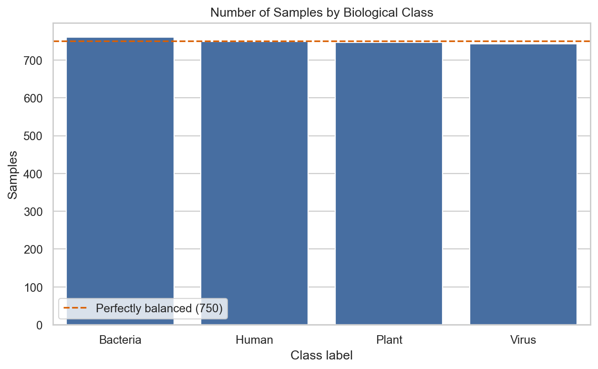

The four classes are almost perfectly balanced (761 / 749 / 747 / 743), so
accuracy is interpretable and **the random-chance baseline is 25%**.

### Is this DNA random?

Real genomes are conspicuously non-random: skewed base composition, positional
structure from codons and motifs, repeated elements, over-represented k-mers.
This section tests for each signature.

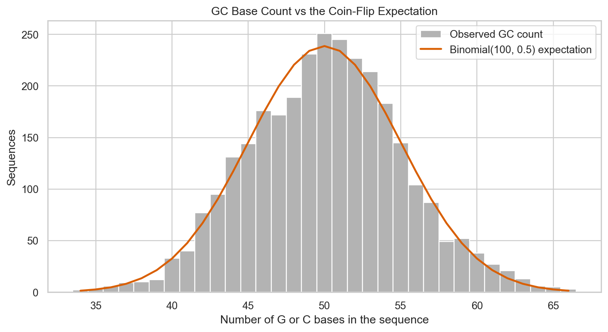

GC content matches `Binomial(100, 0.5)` exactly — mean 50.12 vs 50.0 expected
(p = 0.19), variance 25.63 vs 25.0 (p = 0.33), binned goodness of fit p = 0.31.
The sequences behave like 100 independent coin flips.

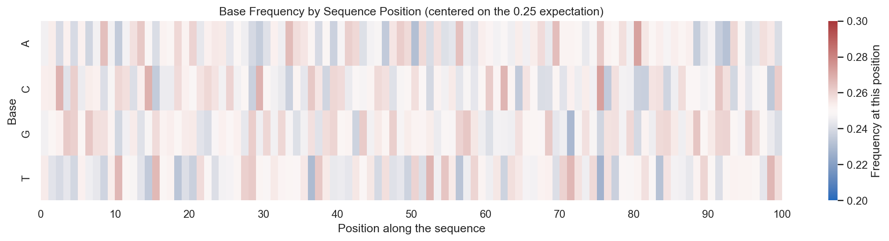

Base frequency by position is uniform noise around 0.25. Six of 100 positions
reach raw p < 0.05 — about the five expected by chance — and **none survives
Bonferroni correction**. No motifs, no codon periodicity.

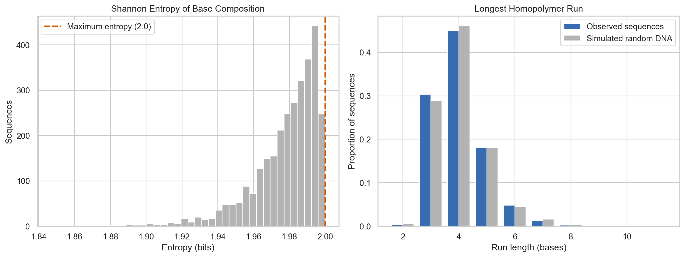

Shannon entropy averages 1.978 of a possible 2.0 bits. The longest homopolymer
run averages 4.016 against 4.037 in simulated random DNA, with a two-sample KS
test returning **p = 0.98**. Real genomes contain poly-A tails and
microsatellites that push this statistic far higher.

### Do any k-mers distinguish the classes?

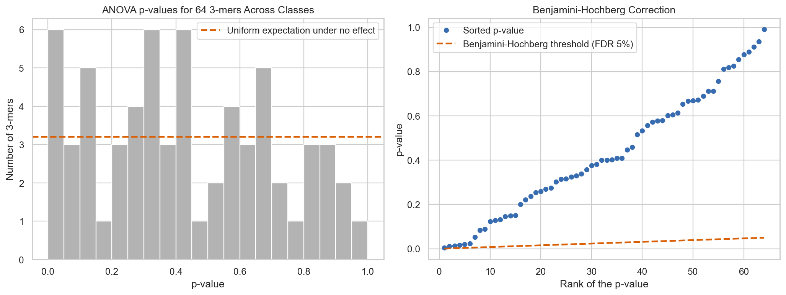

Six of 64 3-mers reach raw p < 0.05 against about 3.2 expected by chance, and
**zero survive Benjamini-Hochberg FDR correction**. The left histogram is the
clearest picture: under a true null hypothesis p-values are uniformly
distributed, and that is exactly what appears — no spike near zero.

### Is there structure in sequence space?

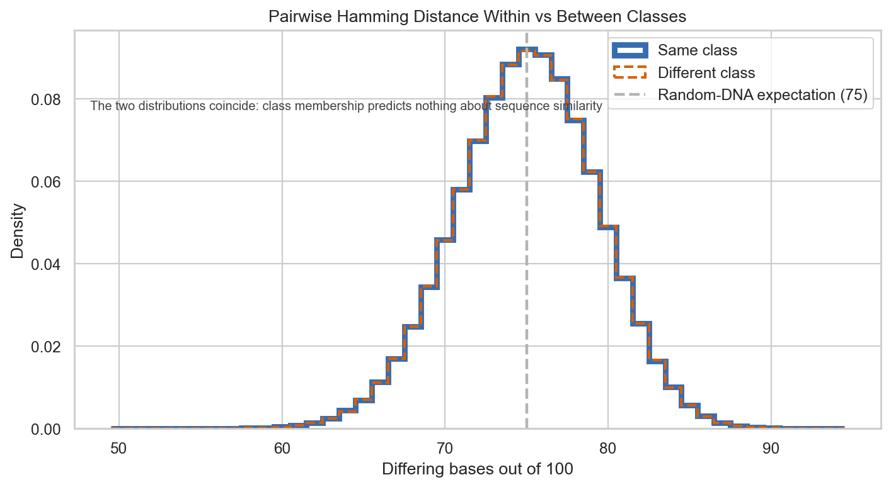

The most direct evidence in the project. Across 4.5 million sequence pairs, two
sequences of the **same** class differ at 74.997 positions on average; two from
**different** classes differ at 74.999. Both sit exactly on the 75.0 expected
for independent random DNA (p = 0.65).

Every classifier depends on same-class examples occupying a shared region of
feature space. Here the class label induces no geometry at all.

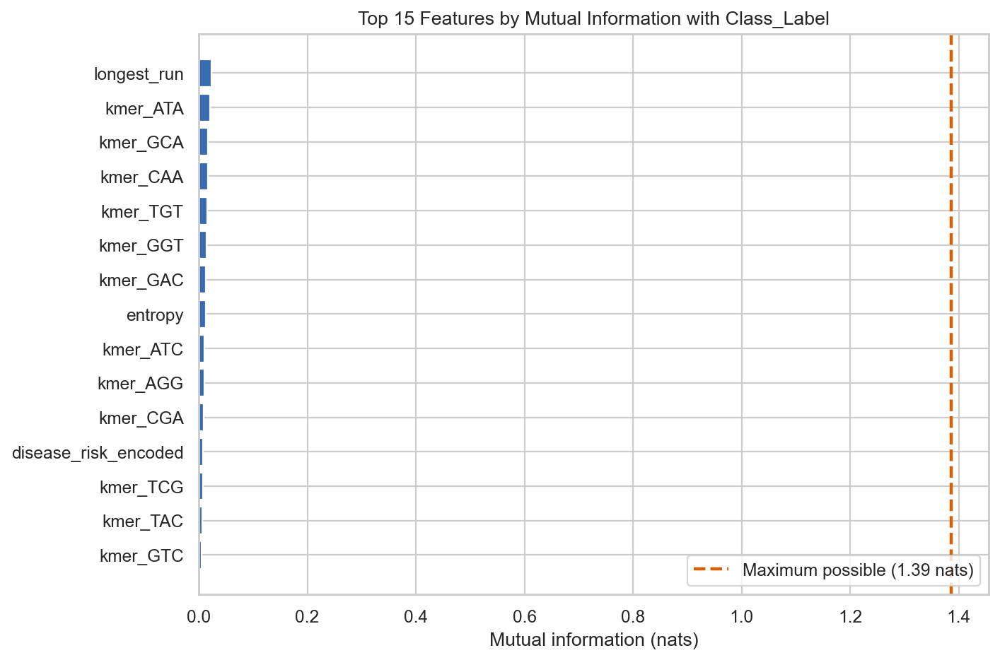

Mutual information captures any dependence, linear or not. The best of 69
features reaches 0.023 nats against a theoretical maximum of 1.386 — about
**1.65%** — and 39 features score exactly zero.

### Effect sizes

Three tests clear p < 0.05 (`Num_G` p = 0.001, `GC_Content` / `AT_Content`
p = 0.003) and survive Bonferroni. Their effect sizes dismantle them:

| Measure | Largest observed | Cohen's "small" threshold |
| --- | --- | --- |
| eta squared | 0.0053 | 0.01 |
| Cramér's V | 0.0380 | 0.10 |

Class membership explains about **half a percent** of the variance in GC
content. This is what 3,000 samples buys: the power to detect effects too small
to use.

---

## Part 2 — Unsupervised learning

[`notebooks/05_dna_unsupervised_learning.ipynb`](notebooks/05_dna_unsupervised_learning.ipynb)

Reads are represented by their **3-mer frequency profile** (64 features), the
standard composition representation in metagenomics, then standardized.

### PCA

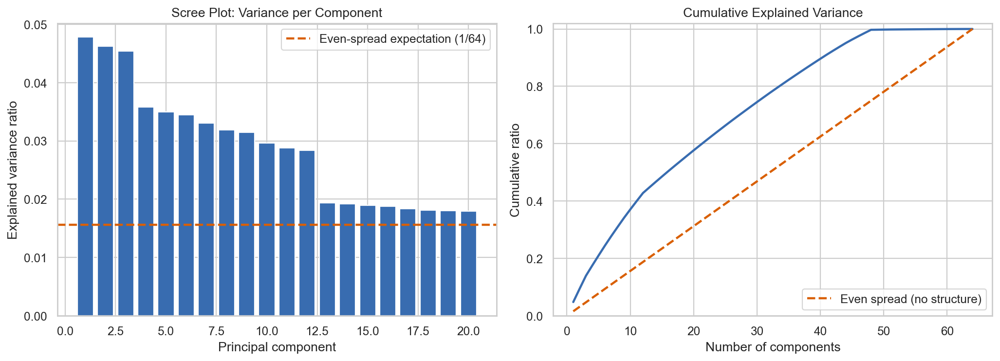

The scree plot is nearly flat. PC1 captures 4.8% against the 1.6% a component
would capture under a perfectly even spread, and **34 of 64 components** are
needed to reach 80% of the variance. The cumulative curve tracks the
no-structure diagonal.

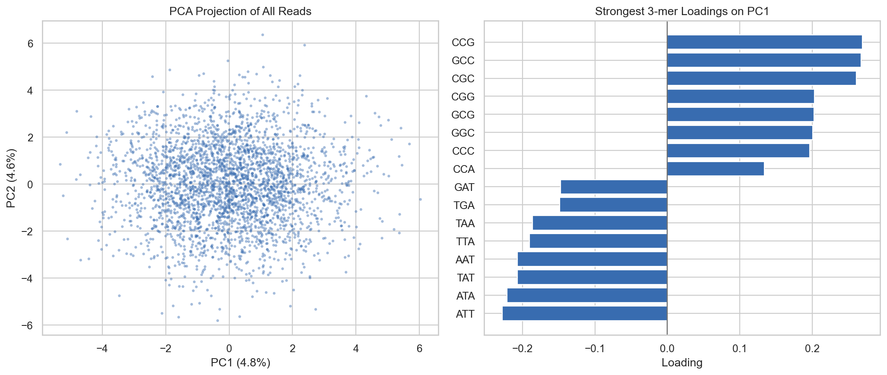

A single roughly circular cloud with one centre and no gaps or satellites. The
loadings panel shows the largest absolute PC1 loading close to the value every
k-mer would have if all 64 contributed equally — PC1 is an arbitrary direction
through a spherical cloud.

### t-SNE — with a control

t-SNE is famous for producing visually convincing islands even on pure noise, so
it is run twice: on the real data, and on the same matrix with each feature
column independently permuted. Permutation destroys joint structure while
preserving every marginal distribution.

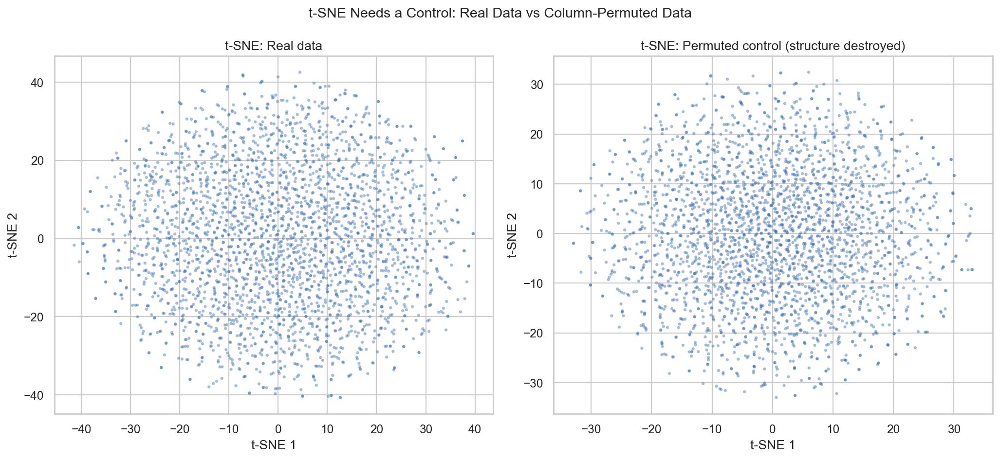

**The two panels are interchangeable.** Whatever texture appears on the left is
produced by t-SNE itself, not found in the data. Any t-SNE plot presented as
evidence of clusters should ship with a control like this one.

### K-Means

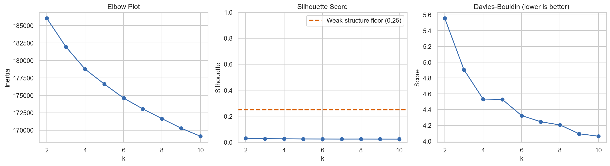

All three diagnostics agree. The elbow plot has no elbow — inertia falls
smoothly as `k` rises, which is what happens when a partition subdivides one
homogeneous cloud. The silhouette peaks at **0.03**, far below the 0.25 floor
for even weak structure. Davies-Bouldin sits between 4 and 5.5 where values near
1 would be expected for separated clusters.

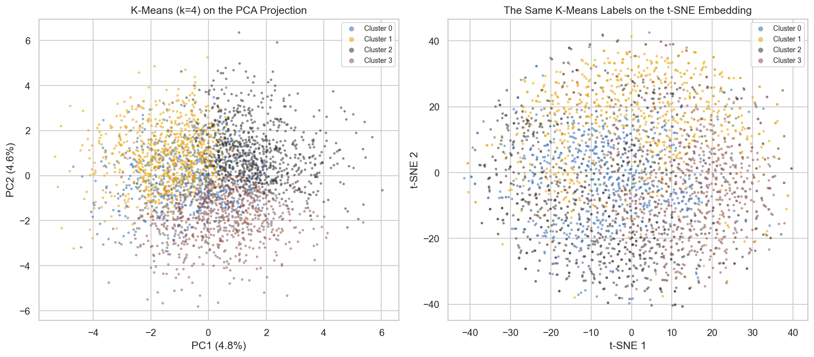

The same K-Means labels in two projections. On PCA the clusters appear as clean
geometric wedges — the signature of Voronoi cells slicing a spherical cloud
rather than of real groups. On t-SNE they form broad, heavily overlapping
gradients with no boundaries and no region belonging exclusively to one cluster.

### Agglomerative clustering

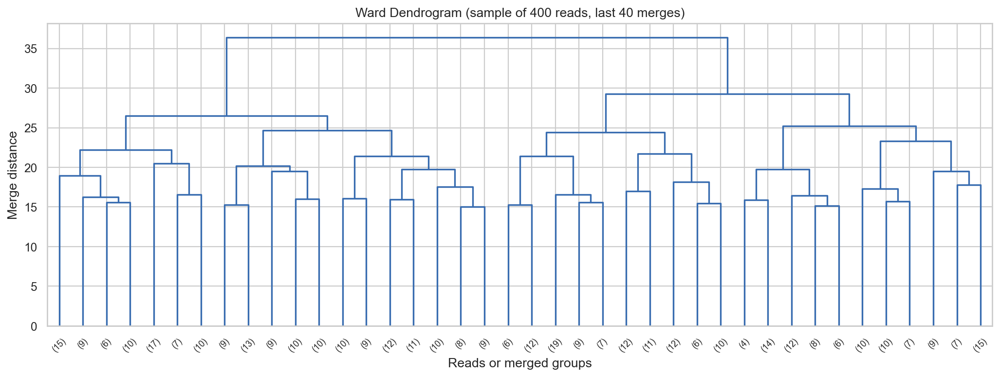

Merge heights rise smoothly with no dominant split, so the number of clusters
depends entirely on where you choose to cut the tree.

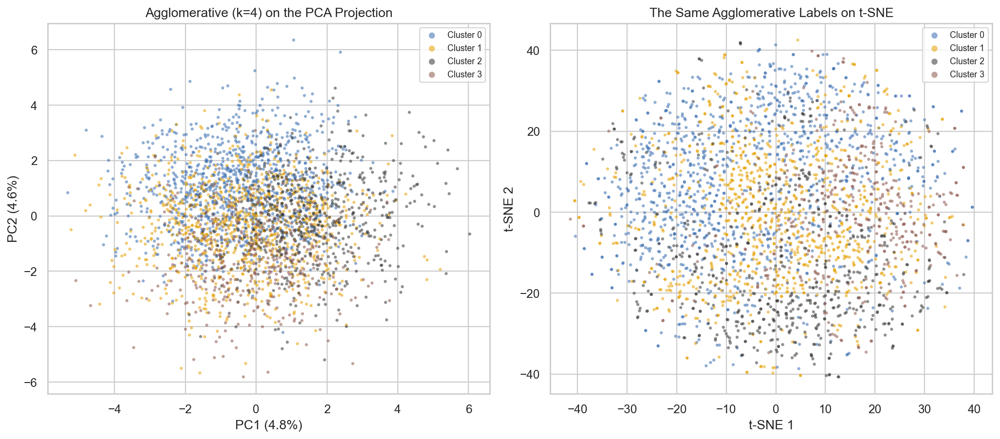

Ward linkage carves the cloud **differently** from K-Means: its clusters overlap
substantially even on PCA, where K-Means produced clean wedges. Two competent
algorithms, the same data, structurally different answers.

### Validation

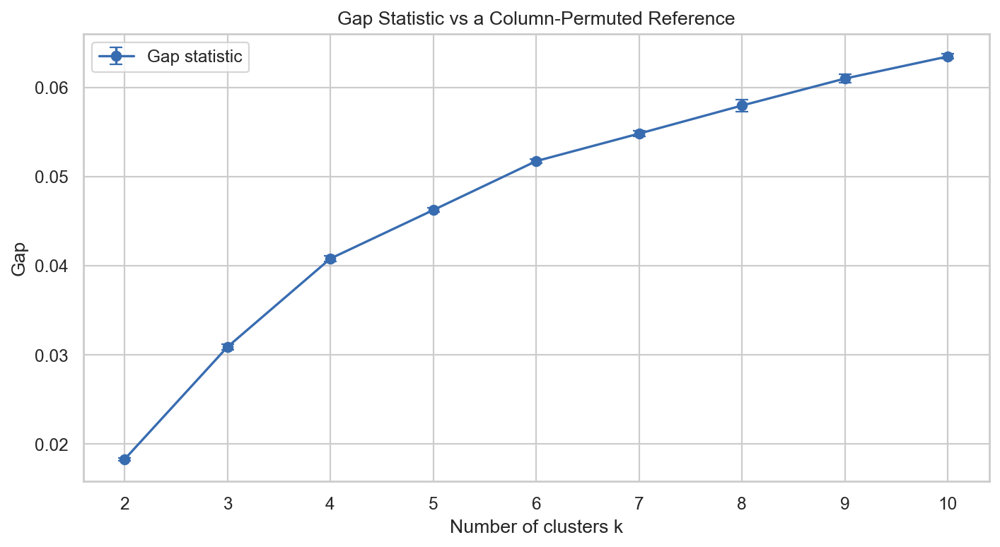

The gap statistic uses a **column-permuted reference** rather than the usual
uniform one. This matters: a uniform reference reports a large positive gap for
a single Gaussian blob, answering the wrong question. Against the permuted
reference the gap rises monotonically from 0.018 to 0.064 and **never peaks**,
so no `k` is preferred.

| Check | Result | Verdict |
| --- | --- | --- |
| K-Means vs Agglomerative (ARI) | 0.13 | Partitions are imposed, not found |
| K-Means vs true labels (ARI) | 0.001 | Clusters carry no class information |
| DBSCAN | All noise, or one cluster with 99% of reads | No density structure |
| Gap statistic | Monotonic, no maximum | No preferred cluster count |

**Business decision: do not build the routing system.** A negative result,
properly evidenced, saves the budget it would have consumed.

---

## Part 3 — Anomaly detection for quality control

Clustering asks "are there groups?" and the answer is no. Anomaly detection asks
"which reads are unlike the rest?" — and a homogeneous background is the *ideal*
setting for that question, because "normal" is well defined.

Four realistic artifacts are injected into a held-out evaluation set at a 3%
contamination rate. The detectors are fitted on clean reads only and never see
an anomaly label.

| Artifact | Simulation | Real-world cause |
| --- | --- | --- |
| Adapter contamination | Known 20-base adapter spliced into the read | Incomplete adapter trimming |
| Homopolymer artifact | 25-40 base run of one nucleotide | Sequencer miscall in low-complexity regions |
| GC-shifted contaminant | Read regenerated at 70% GC | Foreign organism in the sample |
| Chimeric read | Two halves from different reads | PCR chimera formation |

### Detector comparison

| Detector | ROC AUC | Avg. precision | Recall @ 5% | Recall @ 10% |
| --- | --- | --- | --- | --- |
| **Isolation Forest** | **0.872** | 0.578 | 0.650 | **0.750** |
| One-Class SVM | 0.861 | 0.673 | 0.650 | 0.725 |
| Local Outlier Factor | 0.850 | 0.624 | 0.625 | 0.700 |
| Elliptic Envelope | 0.737 | 0.458 | 0.500 | 0.500 |

### Recall by artifact type at a 5% review budget

| Artifact | Isolation Forest | LOF | One-Class SVM |
| --- | --- | --- | --- |
| Homopolymer | 100% | 100% | 100% |
| Adapter | 80% | 100% | 100% |
| GC shift | 80% | 50% | 60% |
| Chimera | 0% | 0% | 0% |

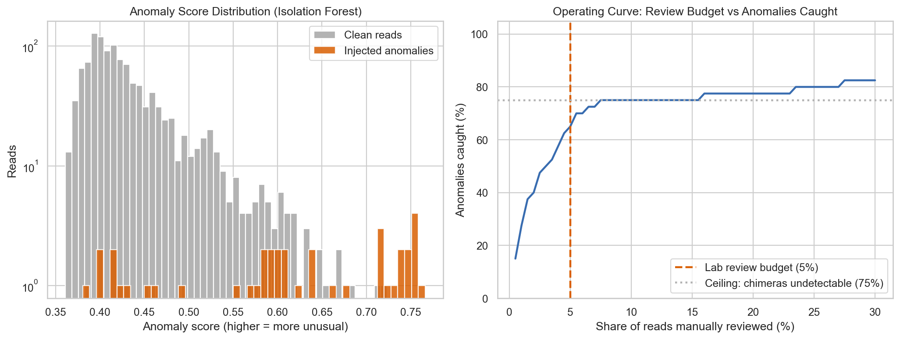

The 75% ceiling is not a coincidence: chimeras are 25% of the injected artifacts
and are **undetectable by construction**, since a chimera of two ordinary reads
has ordinary composition. At a 10% budget the detector catches everything that
is catchable. Detecting chimeras requires alignment to a reference — a different
instrument entirely.

---

## Deployment

The Isolation Forest is refitted on all 3,000 clean reads and saved with
calibrated score thresholds.

| Review budget | Flag scores above | Share of clean reads flagged |
| --- | --- | --- |
| 2% | 0.5943 | 2.0% |
| 5% | 0.5497 | 5.0% |
| 10% | 0.5153 | 10.0% |

Thresholds are stored rather than percentages: incoming batches vary in size and
contamination, so "flag everything above this score" keeps the decision rule
stable, where "flag the top 5%" would review 5% even in a batch with no problems
at all.

### Streamlit quality-control app

```bash
streamlit run app/streamlit_app.py
```

Paste a read or upload a CSV, pick the review budget, and the app returns the
anomaly score, the verdict, and the seven quality features that drove it. The
app also surfaces the detector's known blind spot — chimeric reads — because
that limitation is stored in the model bundle.

---

## Installation

```bash
python -m venv .venv
```

Windows:

```powershell
.venv\Scripts\Activate.ps1
```

macOS / Linux:

```bash
source .venv/bin/activate
```

Install dependencies:

```bash
python -m pip install -r requirements.txt
```

## Usage

Run the notebooks in order:

```bash
jupyter lab notebooks/
```

Or execute them non-interactively:

```bash
make notebooks
```

Launch the quality-control app:

```bash
streamlit run app/streamlit_app.py
```

## Tests

```bash
python -m pytest tests
```

74 tests covering dataset integrity, sequence validation, feature extraction,
the quality-control features, and the saved detector bundle — including that
score thresholds flag the intended share of reads and that known artifacts clear
them.

---

## Methodological notes

These are the traps this project ran into, kept because they generalize:

- **Clustering algorithms always return clusters.** K-Means with `k=4` returns
  four groups whether or not four exist. The silhouette, the gap statistic, and
  cross-algorithm ARI are what separate discovery from imposition.
- **t-SNE always looks clustered.** Always show a permuted or random control
  beside it.
- **Choose the gap statistic's reference deliberately.** A uniform reference
  reports a large gap for a single Gaussian blob; a column-permuted reference
  answers the question actually being asked.
- **Treat convergence warnings as results.** Elliptic Envelope emitted 568
  "Determinant has increased" warnings from a near-singular covariance, and that
  broken fit had promoted it to *first place* at AUC 0.856. Fixing the
  covariance moved it to last at 0.737. Silencing the warnings would have
  shipped the wrong recommendation.
- **Match features to model assumptions.** A feature that is zero for 99% of
  rows breaks a Gaussian model and is harmless to a tree.
- **Correct for multiple comparisons.** Six of 64 k-mers looked significant
  until Benjamini-Hochberg was applied; none survived.
- **Significance is not effect size.** With 3,000 samples, p = 0.001 accompanied
  an eta squared of 0.005 — below the smallest conventionally meaningful effect.
- **A negative result, properly evidenced, is a deliverable.** It prevented a
  routing system that would have sorted reads at random.

---

## Tech stack

`Python 3.12` · `scikit-learn` · `pandas` · `NumPy` · `SciPy` · `Matplotlib` ·
`seaborn` · `Streamlit` · `Jupyter` · `pytest` · `flake8`

## License

Distributed under the MIT License. See [`LICENSE`](LICENSE) for details.

## Author

**Rafael Gallo** — [GitHub](https://github.com/RafaelGallo)
